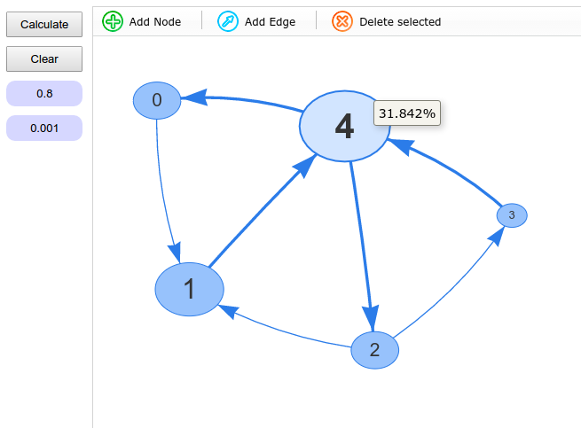

# PageRank
Visualization of work PageRank algorithm with dynamic network graph.

You just need to set coefficient "beta", expected precision and see result!
Also, you can dynamically add or delete nodes and edges. 
As result, you can see resized nodes depending their PageRank. Rank of specified node shown by tooltip.

``